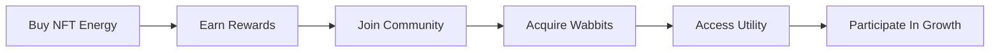

# 🌐 Ecosystem

## Overview

NFT Energy is more than an energy drink.

It's an ecosystem designed to connect products, rewards, ownership, and community into one experience.

Every piece of the ecosystem works together to create value for customers, holders, partners, and supporters.

---

## 🥤 NFT Energy

The foundation of the ecosystem.

NFT Energy is a premium energy drink built to compete with the biggest brands in the category.

Every can introduces consumers to the NFT Energy ecosystem.

### Purpose

- Deliver great energy
- Build brand awareness
- Create customer acquisition
- Power ecosystem growth

---

## 🐰 Energy Wabbits


The community layer.

Energy Wabbits are the official NFT collection of NFT Energy.

### Collection Details

| Item | Value |
|--------|--------|
| Supply | 2,500 |
| Blockchain | Solana |
| Type | Membership NFT |

### Benefits

- Community Access
- Governance
- Utility
- Staking
- Ecosystem Rewards

---

## 🎮 Lunarverse Platform

The utility layer.

Lunarverse is where community members interact with the ecosystem.

### Features

- Staking
- Scratch Tickets
- Energy Vault
- Rewards
- Quests
- Leaderboards

---

## ⚡ How The Ecosystem Works



---

## 🔄 Ecosystem Flywheel

```text
Drinks Sold
     ↓
More Revenue
     ↓
More Rewards
     ↓
More Participation
     ↓
Stronger Community
     ↓
More Drinks Sold
```

---

## 🎯 Why It Matters

Most brands focus on selling products.

NFT Energy focuses on building relationships.

Every purchase creates the opportunity for:

- Rewards
- Participation
- Ownership
- Community Growth

---

## 📊 Ecosystem Snapshot

| Component | Role |
|------------|---------|
| NFT Energy | Product |
| Energy Wabbits | Community |
| Lunarverse | Utility Platform |
| Rewards | Engagement |
| Partners | Expansion |
| Holders | Participation |

---

## 💡 Core Philosophy

```text
The drink is the entry point.

The Wabbit is the key.

The ecosystem is the opportunity.
```
