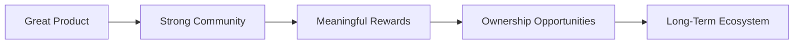

# 🚀 Brand Overview

<p align="center">
  
</p>

<h2 align="center">
Drink it. Own it.
</h2>

<p align="center">
Fuel the grind. Own the upside.
</p>

---

## 🥤 Who We Are

NFT Energy is a premium energy drink brand built for creators, builders, entrepreneurs, gamers, and anyone chasing their next goal.

We believe consumers deserve more from the brands they support.

Most products end the relationship at purchase.

NFT Energy starts the relationship there.

---

## 🎯 Mission

<p align="center">
  
</p>

Make ownership, rewards, and community participation accessible through a product people already enjoy every day.

Our mission is simple:

```text
Create a great product.
Build a great community.
Reward the people who support it.
```

---

## 🌎 Vision

<p align="center">
  
</p>

To become the brand that bridges physical products and digital ownership.

A future where every purchase creates value beyond the transaction.

---

## ⚡ What Makes Us Different

<p align="center">
  
</p>

| Traditional Brands | NFT Energy |
|-------------------|------------|
| Sell products | Build relationships |
| Focus on transactions | Focus on participation |
| Customers | Community |
| One-time purchase | Ongoing engagement |
| Consume and move on | Consume and unlock more |

---

## 🔥 Our Belief

<p align="center">
  
</p>

We believe ownership should not be limited to investors, insiders, or tech experts.

It should be available to everyone.

Whether you're buying your first can or becoming a long-term supporter, there should always be an opportunity to participate in something bigger.

---

## 🏗️ What We Stand For

### Ownership Beyond Consumption

Products should create lasting relationships.

### Rewarding Participation

Support should be recognized and rewarded.

### Community First

The community is part of what we build.

### Accessibility

Anyone should be able to participate.

No experience required.

---

## 📈 The Bigger Picture

<p align="center">
  
</p>



Everything starts with the product.

Everything grows through the community.

---

## 💡 Core Promise

```text
Every can earns more than energy.
```

NFT Energy is not just a drink.

It's the beginning of a larger experience.
